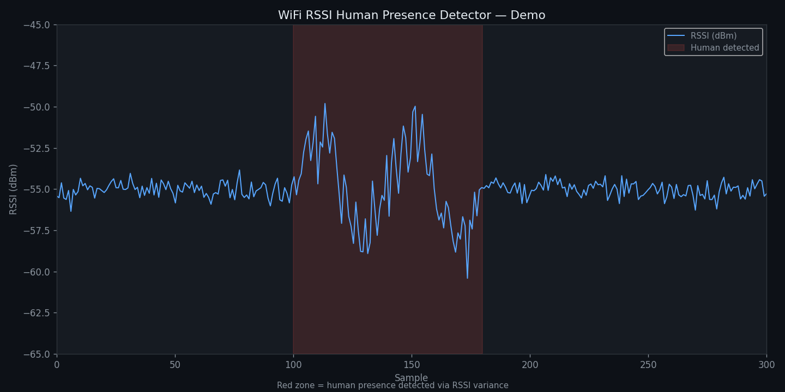

# WiFi RSSI Human Presence Detector

> **Camera-free, privacy-preserving human presence detection using your laptop's built-in WiFi card — no extra hardware needed.**


---

## What is this?

Most WiFi presence detection projects require dedicated hardware like ESP32s or specialised CSI tools. This project does it with **just your laptop** — no extra devices, no hardware flashing, no soldering.

Your laptop's WiFi card is put into **monitor mode** — a passive listening state where it captures all nearby 802.11 packets without connecting to any network. When a human enters a room, their body (~70% water) absorbs and reflects 2.4 GHz signals, causing measurable changes in the **RSSI (Received Signal Strength Indicator)** of sniffed packets. This project detects those changes in real time.

---

## How it works

```
Nearby router/devices
  │  (beacon frames, probe requests, data packets)
  │
  ▼
Laptop WiFi card (monitor mode)
  │  passive sniff via Scapy + RadioTap header
  │
  ▼
RSSI extraction (~20 packets/sec)
  │
  ▼
┌─────────────────────────────────────┐
│  Detection Algorithm                │
│  ├── Z-score vs calibrated baseline │
│  ├── Rolling variance ratio         │
│  └── FFT dominant motion frequency  │
└─────────────────────────────────────┘
  │
  ▼
Live 3-panel dashboard (matplotlib)
  ├── RSSI signal plot
  ├── Detection scores (Z-score + variance)
  └── FFT motion spectrum (0–4 Hz)
```

**Detection states:**
| Status | Condition |
|--------|-----------|
| 🟢 No human detected | Z-score ≤ 1.8, variance ratio ≤ 2.0 |
| 🟡 Human detected — Stationary | Z-score > 1.8 or variance ratio > 2.0 |
| 🔴 Human detected — Moving | Z-score > 3.5 or variance ratio > 3.5 |

---

## Demo

> **Simulation mode** (no hardware required):



*Live dashboard showing RSSI signal, detection scores, and FFT motion spectrum cycling through empty → stationary → moving phases*

---

## Hardware Requirements

| Component | Requirement |
|-----------|------------|
| WiFi chipset | Intel AX200 / AX201 / AX210 (most Intel laptops 2019+) |
| OS | Linux (tested on Arch Linux, kernel 6.12 LTS) |
| Privileges | sudo (for monitor mode) |

Check your chipset:
```bash
lspci | grep -i network
```

Check monitor mode support:
```bash
sudo iw phy phy0 info | grep -i monitor
```

If you see `* monitor` — you're good to go.

---

## Installation

```bash
# Clone the repo
git clone https://github.com/m4g3shw4r/wifi-rssi-presence-detector
cd wifi-rssi-presence-detector

# Create virtual environment
python -m venv venv
source venv/bin/activate

# Install dependencies
pip install scapy numpy matplotlib
```

---

## Usage

### Simulation mode (no hardware, no sudo)
```bash
source venv/bin/activate
python rssi_detector.py --sim
```

### Live detection mode
```bash
# Find your interface name
ip link

# Run (requires sudo for monitor mode)
sudo venv/bin/python rssi_detector.py --iface wlp0s20f3
```

> **Note:** Your WiFi connection will drop while running in live mode. On Ctrl+C, the card is automatically restored to managed mode and NetworkManager reconnects.

---

## What happens to your WiFi

- `sudo python rssi_detector.py` → NetworkManager is stopped, card enters monitor mode
- Detection runs, RSSI packets are sniffed passively
- `Ctrl+C` → card restored to managed mode, NetworkManager restarted, WiFi reconnects in ~5 seconds

No permanent changes are made to your system.

---

## Detection Algorithm

### 1. Calibration (first 60 packets)
Collects baseline RSSI while room is empty. Computes mean and standard deviation.

### 2. Z-score
```
Z = |mean(recent 15 packets) - baseline_mean| / baseline_std
```
High Z-score = RSSI has deviated significantly from baseline = presence detected.

### 3. Variance Ratio
```
var_ratio = std(last 20 packets) / std(baseline)
```
Human movement causes RSSI to fluctuate more than an empty room.

### 4. FFT Motion Frequency
128-point FFT on the RSSI time series to identify the dominant frequency of movement:
- **0.1–0.5 Hz** — breathing / micro-movement
- **0.5–3.0 Hz** — walking, gesturing, normal activity

### 5. Adaptive Baseline
When the room is calm (Z < 0.8, var_ratio < 1.2), the baseline slowly updates to account for gradual environmental changes (temperature, humidity, nearby devices).

---

## Project Context

This is a companion project to [WiFi-CSI-Human-Detection](https://github.com/s-shrikanth/WiFi-CSI-Human-Detection) which uses an ESP32 for full Channel State Information (CSI) — per-subcarrier amplitude across 52 OFDM channels.

| | This project (RSSI) | CSI project (ESP32) |
|--|--|--|
| Hardware | Laptop only | ESP32 + Router |
| Metric | Single RSSI value/packet | 52-subcarrier amplitude matrix |
| Packet rate | ~20/sec | ~8/sec |
| Detection quality | Good (room-level) | Excellent (per-subcarrier) |
| Setup | pip install + sudo | Flash firmware + serial |
| Through-wall | No | Stage 2+ |

---

## Limitations

- RSSI is a single number per packet — less information than full CSI
- Sensitive to other moving objects (fans, curtains near windows)
- Works best in a room with a nearby router (same room or adjacent)
- Detection range: ~3–5 meters from the laptop

---

## Repository Structure

```
wifi-rssi-presence-detector/
├── rssi_detector.py      # main detector script
├── docs/
│   └── demo_placeholder.png
├── requirements.txt
├── .gitignore
└── README.md
```

---

## Authors

**R. Mageshwar** — B.E. EEE, Meenakshi Sundararajan Engineering College, Chennai
GitHub: [m4g3shw4r](https://github.com/m4g3shw4r)

*Related project by S. Shrikant: [WiFi-CSI-Human-Detection](https://github.com/s-shrikanth/WiFi-CSI-Human-Detection)*

---

## License

MIT License
